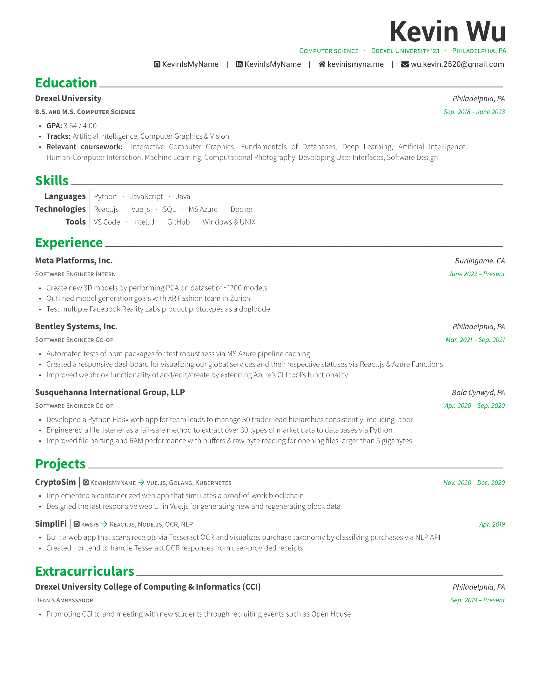

# resume

## Install

**You must have [TeX](https://tug.org/texlive/quickinstall.html) installed!**

Windows: Install [TexLive](https://tug.org/texlive/windows.html#install) with install-tl-windows.exe

```sh
$ tlmgr install texlive-xetex texlive-fonts-extra
```

macOS: Install [MacTeX](https://tug.org/mactex/)

```sh
$ sudo tlmgr option repository ctan
$ sudo tlmgr update --self
$ sudo tlmgr install fontawesome
```

Ubuntu:

```sh
$ sudo apt-get update
$ sudo apt-get install -y texlive-xetex texlive-fonts-extra
$ sudo apt-get install -y texlive-extra-utils # Recommended for VS Code, not required
```

## Usage

```sh
$ git clone https://github.com/KevinIsMyName/resume.git
$ cd resume
$ xelatex resume.tex # Windows and Ubuntu ONLY
$ lualatex resume.tex # macOS ONLY
```

Using VS Code? Try this [LaTeX extension by James Yu](https://marketplace.visualstudio.com/items?itemName=James-Yu.latex-workshop)!

## Preview an example PDF



## Disclaimer

I forked this repository from [https://github.com/posquit0/Awesome-CV/](https://github.com/posquit0/Awesome-CV/) and edited the template for my own purpose.
